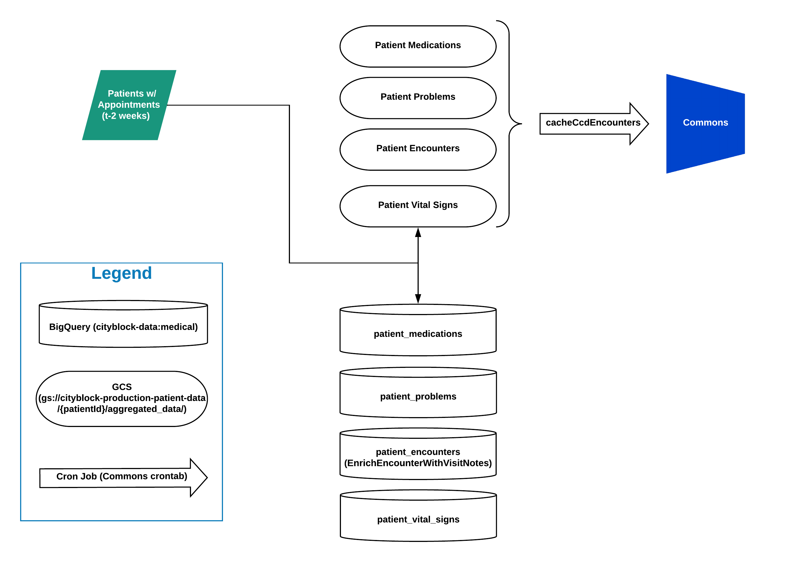

# scio-jobs

## Raison d'être

Project containing parsers and dataflow jobs responsible for parsing inbound data and loading it into bigquery,
plus any other computations related to said data.

- [Onboarding](#onboarding)
  - [Development cycle](#development-cycle)
    - [Planning](#planning)
    - [Writing Code](#writing-code)
  - [TODOs](#todos)
- [Features](#features)
  - [sbt-pack](#sbt-pack)
  - [Testing](#testing)
    - [Inspect an `SCollection`](#inspect-an-scollection)
  - [Scala style](#scala-style)
  - [Scalafmt](#scalafmt)
  - [REPL](#repl)
  - [Local documentation generation](#local-documentation-generation)
- [Manual Orchestration](#manual-orchestration)
  - [Cohort Load](#cohort-load)
  - [Partner Data Import](#partner-data-import)
- [Jobs](#jobs)
  - [PatientIndexImporter](#patientindeximporter)
  - [RedoxSubscriber](#redoxsubscriber)
  - [Staging Run \(with staging data/creds\)](#staging-run-with-staging-datacreds)
    - [Dev Run \(with Prod data\)](#dev-run-with-prod-data)
    - [Prod Run](#prod-run)
  - [ElationSubscriber](#elationsubscriber)
    - [Dev Run \(against Staging data\)](#dev-run-against-staging-data)
    - [Prod Run](#prod-run-1)
  - [PushElationPatientEncounters](#pushelationpatientencounters)
    - [Airflow Prod Run](#airflow-prod-run)
    - [Manual Prod Run](#manual-prod-run)
    - [Manual Dev Run](#manual-dev-run)
  - [Loading Raw Partner Data](#loading-raw-partner-data)
    - [LoadMonthlyDataDump](#loadmonthlydatadump)
    - [LoadEmblemCohortData](#loademblemcohortdata)
    - [LoadCCIData](#loadccidata)
    - [LoadToSilver](#loadtosilver)
  - ["Polish" Jobs](#polish-jobs)
    - [Spawning multiple Dataflow jobs](#spawning-multiple-dataflow-jobs)
    - [PolishEmblemClaims](#polishemblemclaims)
    - [PolishEmblemClaimsCohort](#polishemblemclaimscohort)
    - [PolishCCIClaims](#polishcciclaims)
  - [Pushing Data to Commons](#pushing-data-to-commons)
    - [PushPatientClaimsEncounters](#pushpatientclaimsencounters)
    - [PushPatientEligibilities](#pushpatienteligibilities)
    - [PublishMemberAttributionData](#publishmemberattributiondata)
  - [Computed Fields Jobs](#computed-fields-jobs)
    - [Development](#development)
    - [Resending results](#resending-results)
    - [Printing the SQL](#printing-the-sql)
  - [AdhocZendeskMemberCreation](#adhoc-zendesk-member-creation)

## Onboarding

Navigate to the starter project, [Chapter 1](../starter_project/Chapter_1/README.md).

### Development cycle

#### Planning

1.  Roadmap!
1.  Product + Clinical meeting to gather full requirements
1.  Product writes up a PRD to document feature
1.  Dev writes up solution based on Engineering Design Document template
1.  Send solution around for review and review tradeoffs with product / clinical team if needed
1.  After sufficient agreement on solution, break out into Asana tasks

#### Writing Code

1.  Code complete with appropriate unit testing
1.  In tandem:
    - Code review
    - Testing
      - Deploy to development
      - Test in development
      - Deploy to prod
      - Verify in prod
1.  Merge pull request
1.  Tag and deploy to prod

#### Running a Scio job in the Development environment
We have a dedicated GCP project for running the job that serves as a development/test environment
 before merging into production. A successful run from this place should serve as validation on a
 given Pull Request on GitHub.
 
Ensure the following flags specified in the arguments for your job:
```
sbt "runMain ....  # your class here
    --project=cityblock-development
    --serviceAccount=dataflow@cityblock-development.iam.gserviceaccount.com
    --runner=DataflowRunner
    --...
    --..."  # rest of your arguments
```
Please design your code such that the arguments are configurable for read/write to a development location (such 
 as the ephemeral `cityblock-development.testing` BigQuery dataset) so your job does not fail preemptively.
The service account should have the same permissions as the production account. If not, and you run into 
 permission issues, please open a Pull Request in `/terraform` granting the service account the missed permission(s).

### TODOs

If you notice an opportunity for improvement that's out of scope for the current issue, please add a `// TODO` comment
to the code. This could be as simple as `// genericise these functions`. Eventually we'll have a more official tracking
system, but for now we're using IntelliJ's built in `TODO` aggregator.

## Features

This project comes with number of preconfigured features, including:

### sbt-pack

Use `sbt-pack` instead of `sbt-assembly` to:

- reduce build time
- enable efficient dependency caching
- reduce job submission time

To build package run:

```bash
sbt pack
```

### Testing

This template comes with an example of a test, to run tests:

```bash
sbt test
```

It is possible to run tests on a specific TestClass, by running the following command:

```bash
sbt 'test:testOnly *TestClass'
```

It is also possible to run a single test on a specific TestClass, by running the following command:

```bash
sbt 'test:testOnly *TestClass -- -z "test name goes here"'
```

#### Inspect an `SCollection`

To view the contents of an SCollection while running a test:

```bash
collection.debug(out = () => Console.err)
```

By default, `debug` writes to stdout, which is swallowed by `sbt`.

**Note:** When using `debug` on an SCollection, it displays on the screen the same output for values
of `List[String]()` and `List[String]("")`. This same issue occurs upon using SCollection matchers
and the output is displayed simply as `List()`.

### Scala style

Find style configuration in `scalastyle-config.xml`. To enforce style run:

```bash
sbt scalastyle
```

### Scalafmt

Scalafmt is automatically enabled to run on compilation. If you want to run it manually you can run `sbt scalafmt`. You may also be interested in
the [IntelliJ plugin](https://scalameta.org/scalafmt/#IntelliJ).

### REPL

To experiment with current codebase in [Scio REPL](https://github.com/spotify/scio/wiki/Scio-REPL)
simply:

```bash
sbt repl/run
```

### Local documentation generation

To generate and view documentation of the codebase locally merely:

```bash
sbt doc && open target/scala-2.12/api/index.html
```

## Manual Orchestration

Automated orchestration of multiple scio-jobs is currently under development. Existing manual
procedures are documented here.

### Cohort Load

Before you start, talk to @bill and gather
- `$partnerProject`, i.e., which partner's members are we importing?
- `$cohortName`, typically something like `cohort3b`
- `$assignmentTableName`, usually suffixed with `_assignment`

1. Determine the next cohort id. Perform a migration in the member service for the new cohort. This migration should
generate a new Cohort ID for the member.

1. Populate the cohort assignment table with the new member's insurance ID, cohort name and risk category ID (not the
risk category name).

1. Run the [PatientIndexImporter](#patientindeximporter) on the new cohort table assignment and it should load the new
members to the member service and mint new IDs for these members.

1. Manually trigger the [Member Index Mirror Dag on Airflow](https://r924531339b5480d9-tp.appspot.com/admin/airflow/tree?dag_id=prod_member_index_mirroring_v1)

1. Generate the appropriate `cohort_ingestion` table by running a join with the cohort assignment table with the member service
mirror to grab the member's new UUID and category name.

1. From the above query that we used, add the new members to `cityblock-data.manual_load_datasets.cohort_assignment`. We can do this 
 by running the query we constructed above and appending the results to `cityblock-data.manual_load_datasets.cohort_assignment`
 using `More -> Query settings` from the BigQuery UI (set "Destination table write preference" to "Append to table").
   
1. Finally, run MemberAttribution job to publish to Commons.

### Partner Data Import

We receive a monthly data dump from each insurance partner, and we have an implicit SLA to make this
data available in BigQuery and Commons as soon as possible.

*The Emblem import works a little differently. Reach out to data-eng for context*.

1. Determine the datestamp of the new data dump
   - An easy way to do this is to run
     ```bash
     gsutil ls -l gs://cbh_sftp_drop/${partner}_production/drop/ | sort -k 2
     ```
     and look at the most recent files.
1. Run the partner's "load" and "polish" jobs in sequence with this date as an argument
1. Reach out to data-eng to manually QA the import (automated QA is under development).
1. Run `PushPatientClaimsEncounters` and `PublishMemberAttributionData`.
1. Run the [update views](../containers/load_monthly_data/update_views.py) for views relevant to the jobs (silver or gold)
1. Email data-team@cityblock.com and eng-all@cityblock.com announcing that this partner's new data
   has been loaded.
   
If there are QA issues, it may several days (or in the worst case several weeks) to clear up QA
issues.

## Jobs


### PatientIndexImporter

This job takes `CohortIngestionRequest`s and adds them to the Member Service. Currentlty, this job is used when the partners are
Emblem and ConnectiCare but not for tufts.

For example,
```bash
sbt "runMain cityblock.importers.common.PatientIndexImporter
    --requestLocation=connecticare-data.assignment.cohort3a_ingestion_request
    --environment=prod --partner=connecticare --persist=true
    --tempLocation=gs://internal-tmp-cbh/temp --runner=DirectRunner"
```

When you run this as is, it writes out each entry into the Member Service. Change the flag, `--persist=false` to output to screen
and not write to the member service. 

### ClinicalSummaryRefresher
This job runs as a daily batch job in Airflow at the moment, and works by looping through all patients that have had
appointment events in the past two weeks (creations or modifications), pulls their Clinical Care Document, and their
corresponding visit note for each encounter found in the clinical care document.

This information sends messages to both Pub/Sub (for pushing updates to Commons) and GCS (as a cache for Commons).

When you run this job in testing, please be sure to make sure that the external IP address for the dataflow job has been
whitelisted in the Prod Member Service App Engine Firewall in GCP (if using prod data in dev).

This job requires Redox API credentials. Fetch them from [OneLogin](https://cityblock.onelogin.com/notes/61787). If you
don't have access, contact data-eng.

Execute the following to run the job with production redox credentials set in `../main/resources/application.conf:`, as
well as the configurations set for the akka logger (see the example config).

For more context on how Clinical Summaries refresh, see below:



#### Dev Run

```bash
target/pack/bin/ClinicalSummaryRefresher \
--runner=DataflowRunner \
--environment=prod \
--project=cityblock-data \
--workerMachineType=n2-highcpu-16 \
--jobName=test-lauren-batch-update-redox-clinical-summaries \
--streaming=false \
--patientDataBucket=gs://cbh-lauren-friedmann-scratch \
--clinicalInfoUpdateTopic=devClinicalInformationUpdateMessages \
--redoxMessagesTable=dev_redox_messages \
--medicalDataset=dev_medical \
--tempLocation=gs://cbh-lauren-friedmann-scratch/temp
```

### RedoxSubscriber

This listens for streaming messages from RedoxPublisher and transforms/persists the data to BigQuery (for analysis), GCS
(as a cache for Commons), and PubSub (for pushing updates to Commons).

### Staging Run (with staging data/creds)
Make sure to set `patientDataBucket` with your own scratch bucket, or omit it to use the default one for staging:
```
sbt "runMain cityblock.streaming.jobs.RedoxSubscriber \
--runner=DataflowRunner \
--environment=staging \
--project=staging-cityblock-data \
--jobName=test-redox-subscriber-$USER \
--streaming=true \
--subscription=projects/corded-observer-196516/subscriptions/redox-subscriber \
--schedulingTopic=schedulingMessages \
--hieTopic=hieEventMessages \
--redoxMessagesTable=redox_messages \
--rawHieWithPatientTopic=stagingRawHieEventMessages \
--medicalDataset=medical \
--patientDataBucket=gs://cbh-kirill-levin-scratch"
```

#### Dev Run (with Prod data)
```
sbt "runMain cityblock.streaming.jobs.RedoxSubscriber \
--runner=DataflowRunner \
--environment=prod \
--project=cityblock-data \
--jobName=dev-redox-subscriber \
--streaming=true \
--subscription=projects/p-redox-publisher/subscriptions/devRedox-subscriber \
--schedulingTopic=devSchedulingMessages \
--hieTopic=devHieEventMessages \
--rawHieWithPatientTopic=devRawHieEventMessages \
--redoxMessagesTable=dev_redox_messages \
--medicalDataset=dev_medical \
--patientDataBucket=gs://dev-cityblock-production-patient-data"
```

### Deploying RedoxSubscriber

To deploy RedoxSubscriber...

1. Go into the Dataflow UI, stop the job, and choose the ‘drain’ option (so it’ll work through anything that happens to be in the pipeline already before shutting down...anything that shows up from Redox will just hang out until the job is restarted)
2. See the command below to do a production deploy by "pushing" scio to GCP via --runner=Dataflow (e.g. deploying the scio code)... after a while the process will just hang so wait until there's a minute of no logs then CTRL + C `Workers have started successfully.`
3. Once that command is running, go to Compute UI, and refresh the page until you see the `dataflow-redox-subscriber-x` IP address pop up. Once it does, copy + paste it into the Member Service's firewall allowlist in the GCP App Engine UI
4. Go to Dataflow Runner graph to confirm all is green and lag is low (click top node, look at System lag and Wall time)
5. Feel free to keep QAing at Member Service/Commons logs but should be pretty much good to go from here (you can also replay from Redox and see the 1 message go through)

```
sbt "runMain cityblock.streaming.jobs.RedoxSubscriber \
--runner=DataflowRunner \
--environment=prod \
--project=cityblock-data \
--jobName=redox-subscriber \
--streaming=true \
--subscription=projects/p-redox-publisher/subscriptions/redox-subscriber \
--schedulingTopic=schedulingMessages \
--hieTopic=hieEventMessages \
--redoxMessagesTable=redox_messages \
--rawHieWithPatientTopic=rawHieEventMessages \
--medicalDataset=medical"
```

### Troubleshooting

Need to replay Redox messages like HIE events going missing? See 
`RedoxReplayMessages` and make sure to modify the `query` method to find the
missing messages.

```
sbt "runMain cityblock.scripts.RedoxReplayMessages \
--runner=DirectRunner \
--project=cityblock-data \
--tempLocation=gs://dev-cityblock-production-patient-data \
--topic=projects/corded-observer-196516/topics/redoxMessages
```

Try on the staging PubSub topic first:

`--topic=projects/corded-observer-196516/topics/redoxMessages`

Then on prod:

`--topic=projects/p-redox-publisher/topics/redoxMessages`

### ElationSubscriber

[ElationSubscriber](src/main/scala/cityblock/streaming/jobs/ElationSubscriber.scala) mirrors what
RedoxSubscriber accomplishes but with a different source EMR (Elation here vs Epic for Redox).

A GCP cloud function webhook, [elation_hook](../cloud_functions/elation_hook/index.js), is currently live and
automatically recieves POST requests from Elation when certain events occur in Elation. `elation_hook` then publishes
the event to the PubSub topic `elationEvents` in the cityblock-data project.

Elation events we subscribe to:
- Bills
- Patients
- Appointments (parsing in progress)
- Reports (parsing in progress)
- Vitals
- Insurance Companies
- Insurance Plans

ElationSubscriber subscribes to streaming messages from the `elationEvents` PubSub topic, transforms the data, then
persists the data to BigQuery (for analysis), GCS (as a cache for Commons), and PubSub (for pushing updates to Commons).

Execute the following command to run the job with production elation credentials set in
`../main/resources/application.conf:`

#### Dev Run (against Staging data)
Make sure to replace `patientDataBucket` with your own scratch bucket, or omit it to use the default one for staging:
```
sbt "runMain cityblock.streaming.jobs.ElationSubscriber \
--environment=staging \
--runner=DataflowRunner \
--workerMachineType=n1-standard-1 \
--jobName=dev-elation-subscriber-$USER \
--streaming=true \
--project=staging-cityblock-data \
--subscription=projects/staging-cityblock-data/subscriptions/elationEventsScioSub \
--schedulingTopic=projects/staging-cityblock-data/topics/schedulingMessages \
--elationMessagesTable=elation_messages \
--medicalDataset=medical \
--patientDataBucket=gs://cbh-kirill-levin-scratch"
```

#### Prod Run
```
sbt "runMain cityblock.streaming.jobs.ElationSubscriber \
--environment=prod \
--runner=DataflowRunner \
--workerMachineType=n1-standard-1 \
--jobName=elation-subscriber \
--streaming=true \
--project=cityblock-data \
--subscription=projects/cityblock-data/subscriptions/elationEventsScioSub \
--schedulingTopic=projects/cityblock-data/topics/schedulingMessages \
--elationMessagesTable=elation_messages \
--medicalDataset=medical"
```


### PushElationPatientEncounters

The [PushElationPatientEncounters](src/main/scala/cityblock/aggregators/jobs/PushElationPatientEncounters.scala) batch job replaces
the PatientEncounters processing done in the [ElationSubscriber](#elationsubscriber) streaming job.

We currently [mirror](https://console.cloud.google.com/bigquery?project=cityblock-data&p=cityblock-data&d=elation_mirror&page=dataset) 
our Elation Hosted database into BigQuery. This hosted database contains all data that can be 
entered by users of the EHR even if the data is not exposed via the Elation API.

This batch job pulls full visit / non-visit note data from our Elation mirror and appropriately adds contextual data, 
from other tables in the mirror during transformation to the PatientEncounter model.

#### Airflow Prod Run
This job is kicked off via Airflow as a [task](https://github.com/cityblock/mixer/blob/master/cloud_composer/dags/elation_mirror_v2.py#L162) in the `elation_mirror_vx` DAG.

See the [Elation mirror DAG playbook](../cloud_composer/playbooks/elation_mirror.md/#commons-external-dependency-to-dag-task-push_elation_patient_encounters) 
for additional details on the schedule of the DAG task, external dependencies, and debugging tips.

#### Manual Prod Run
You can replicate the [DAG task's `cmds`](https://github.com/cityblock/mixer/blob/master/cloud_composer/dags/elation_mirror_v2.py#L171) if you need to kick-off the job manually for prod.

#### Manual Dev Run
**To kick off the job in development (using prod data), make sure you change these flags to `--patientDataBucket=gs://cbh-your-personal-project-scratch/encounters`
and `--medicalDataset=dev_medical`**. 

This way you read in prod data (since it's hard to stage) but write to dev locations.


### Loading Raw Partner Data

These jobs load CSVs from the appropriate sftp drop folder in GCS, transform the data to silver, and
persist that data in BigQuery. The silver transformation adds the cityblock patientId and assigns a
Cityblock-generated uuid to each row.

Each job has a public variable called `shard` that determines which month's data is pulled from
GCS. When importing a new month's data, make sure you update `shard`.

Note that we are in the process of consolidating these into a single job that takes different
configs per provider. The `LoadToSilver` job is the generic one to use going forward, the other two
should be considered legacy and will eventually be subsumed by it.

#### LoadMonthlyDataDump

In addition to loading data from GCS and persisting to BigQuery, this job also sends member info to
Commons via PubSub.

*This job is only applicable to data delivered on or before 2019-06-12 (this data is prefixed with CBGN). For data
delivered after 2019-06-12, use [LoadEmblemCohortData]($loademblemcohortdata).*

```
sbt "runMain cityblock.importers.emblem.LoadMonthlyDataDump
    --environment=prod
    --runner=DataflowRunner
    --project=cityblock-data
    --deliveryDate=20190612
    --workerMachineType=n1-highcpu-32 
    --numWorkers=6
    --publishMemberDemographics=<true|false>"
```

#### LoadEmblemCohortData

In addition to loading data from GCS and persisting to BigQuery, this job also sends member info to Commons via PubSub.

*This job is only applicable to data delivered after 2019-06-12 (this data is prefixed with CB_COHORT). For data
delivered on or before 2019-06-12, use [LoadMonthlyDataDump]($loadmonthlydatadump).*

```
sbt "runMain cityblock.importers.emblem.LoadEmblemCohortData
    --environment=prod
    --runner=DataflowRunner
    --project=cityblock-data
    --deliveryDate=20190814
    --workerMachineType=n1-highcpu-32 
    --numWorkers=6
    --recomputeUPI=<true|false>
    --publish=<true|false>
```

`recomputeUPI` defaults to `true` and `publish` defaults to false.

#### LoadCCIData

```
sbt "runMain cityblock.importers.connecticare.LoadCCIData 
    --environment=prod
    --runner=DataflowRunner
    --project=cityblock-data 
    --workerMachineType=n1-highcpu-32 
    --numWorkers=6
    --deliveryDate=20190610
    --dataProject=connecticare-data"
```

#### LoadToSilver

Unlike the two jobs above, this one loads data based on config files that are supplied to it. The
configs are located in partner-specific directories under `partner_configs/batch` in this repo.

Configs are specified via the `inputConfigPaths` argument, and can be stored either locally on in
GCS. This behavior is controlled by the `inputConfigBucket` argument. When it is set, the config
paths are assumed to be on the specified bucket, otherwise they are read from local disk.

Example for running this to load ConnectiCare data to production:
```
sbt "runMain cityblock.importers.generic.LoadToSilverRunner \
    --environment=prod \
    --runner=DataflowRunner \
    --inputConfigPaths=`ls -d ../partner_configs/batch/connecticare/* | tr '\n' ',' | sed 's/.$//'` \
    --workerMachineType=n1-highcpu-32 \
    --deliveryDate=20190809 \
    --outputProject=connecticare-data"
```

Note also that all lines that failed to parse are stored in a sharded `ParseErrors` table alongside
the loaded silver data. 

### "Polish" Jobs

We cheekily decided to use "polish" to describe the jobs that emit gold data. Nevermind that transforming bronze to
silver and silver to gold is better described as alchemy, but the convention is fun.

Each job reads from and writes to tables with a specific hard-coded datestamp (which we update upon receiving a new
month's data). Emblem is an exception to this as it's passed in, and soon the rest will follow suit.

If you are testing a "polish" job and you want to save the results to a different GCP project, modify `--destinationProject`.
Standard practice is to use your personal project instead.

The full polish job (for each partner) is very resource-intensive, and generally takes 60-90 minutes to run.

#### Spawning multiple Dataflow jobs

Each of the "polish" jobs spawns multiple dependent dataflow jobs. The basic flow (which varies a bit from partner to partner) is:

1. fetch silver from BigQuery and build indices (e.g., diagnosis by claim id)
1. in parallel, transform to:
   - gold Provider
   - gold Member
   - gold Facility
   - gold Professional
   - gold Pharmacy
   - gold Lab Results
1. persist gold model to BigQuery

If you need to cancel a run, you'll need to cancel all jobs from the run that are in progress. The jobs are all prefixed with
`polish-<partner>`, making them easy to search for. It's easiest to do this from the Dataflow Web UI, but you can also do it
from the CLI.

For runs that spawn a single dataflow job, it's possible to exit the local process after the job has been uploaded to
dataflow. We've yet to confirm whether it's possible to do the same for runs spawning multiple dataflow jobs.

For the time being, you need to keep the local run alive until the final dataflow job is uploaded.

#### PolishEmblemClaims

This loads Emblem claims data in `emblem-data:monthly_claims` and transforms it into silver and gold formats (stored in
`silver_claims` and `gold_claims` respectively).

*This job is only applicable to data delivered on or before 2019-06-12 (this data is prefixed with CBGN). For data
delivered after 2019-06-12, use [PolishEmblemClaimsCohort]($polishemblemclaimscohort).*

```
sbt "runMain cityblock.transforms.emblem.PolishEmblemClaims 
    --runner=DataflowRunner 
    --numWorkers=2
    --deliveryDate=20190612 
    --workerMachineType=n1-standard-32 
    --project=cityblock-data 
    --destinationProject=emblem-data"
```

#### PolishEmblemClaimsCohort

This loads Emblem claims data in `emblem-data:monthly_claims` and transforms it into silver and gold formats (stored in
`silver_claims` and `gold_claims` respectively).

*This job is only applicable to data delivered after 2019-06-12 (this data is prefixed with CB_COHORT). For data
delivered on or before 2019-06-12, use [PolishEmblemClaims]($polishemblemclaims).*

```
sbt "runMain cityblock.transforms.emblem.PolishEmblemClaimsCohort 
    --runner=DataflowRunner 
    --numWorkers=2
    --deliveryDate=20190814 
    --workerMachineType=n1-standard-32 
    --project=cityblock-data 
    --destinationProject=emblem-data"
```

#### PolishCCIClaims

This loads silver CCI claims data from `connectiare-data:silver_claims`, transforms it to gold, and saves it in
`<destinationProject>:gold_claims`.

```
sbt "runMain cityblock.transforms.connecticare.PolishCCIClaims 
    --runner=DataflowRunner 
    --numWorkers=2
    --workerMachineType=n1-standard-32 
    --project=cityblock-data 
    --deliveryDate=20190612 
    --destinationProject=connecticare-data"
```

### Pushing Data to Commons

Once new partner data is QA'd and transformed to gold, we need to push updates to Commons.

These jobs are run after the corresponding "Polish" job completes, with one exception. Emblem's
integration includes legacy code where Commons updates are kicked off from directly from
`LoadMonthlyDataDump`.

#### PushPatientClaimsEncounters

This job creates an encounters abstraction from the `Professional` and `Facility` gold tables,
buckets the encounters by patientId, and saves the results to GCS. Commons reads this information
from GCS to display timeline cards.

This job is not very resource-intensive and completes in ~10 minutes on a single default Dataflow
worker.

```
sbt "runMain cityblock.aggregators.jobs.PushPatientClaimsEncounters 
    --runner=DataflowRunner
    --deliveryDate=20190809
    --sourceProject=connecticare-data
    --environment=prod"
```

Currently, ConnectiCare is the only partner that uses this job. Although the job technically
supports the staging environment, we only support staging claims data for Emblem. As such, this job
should only be run with the above arguments.

#### PushPatientEligibilities

This job gathers certain programs that patients are eligible for and dumps them all under an aggregated
JSON file in GCS that is keyed by patient id. Commons reads this information from GCS to display

This job is not very resource-intensive and completes in ~10 minutes on a single default Dataflow
worker.

NOTE: Once the process for auto-loading eligibility data is in place, we will be updating the source
project. For now, we have to do a manual pull of this data and read from Spencer's sandbox.

```
sbt "runMain cityblock.aggregators.jobs.PushPatientEligibilities
    --project={project}
    --runner={runner}
    --sourceProject={sourceProject}
    --destinationBucket={destinationBucket}"
```

Example local run:

```
sbt "runMain cityblock.aggregators.jobs.PushPatientEligibilities
    --project=cbh-rohan-aletty
    --runner=DirectRunner
    --sourceProject=cbh-rohan-aletty
    --destinationBucket=gs://cbh-rohan-aletty-scratch/
    --tempLocation=gs://cbh-rohan-aletty-scratch/temp/"
```

#### PublishMemberAttributionData

This job uses the gold `Member` table construct PubSub messages containing a member's demographics,
insurance details, and PCP information. These messages are sent to Commons (via PubSub).

This job also saves a copy of each PubSub message to `${sourceProject}.messages.pubsub` for
debugging purposes.

```
sbt "runMain cityblock.importers.common.PublishMemberAttributionData
    --environment=prod 
    --runner=DataflowRunner
    --sourceProjects=connecticare-data
    --deliveryDate=20190809
    --destinationProject=cityblock-data
    --publish=true"
```

If you need to examine the output of this job before pushing PubSub messages, run with
`--destinationProject=<your personal project>` and `--publish=false` (when `publish` is false, no
PubSub messages are sent and the copies are saved to `destinationProject` instead). Make sure that
your personal project contains a dataset named `messages`.

### Computed Fields Jobs

Computed Fields answer patient-level questions from clinical data sources, and send results through PubSub to Commons.
This job runs in production on the Airflow cluster after the dbt nightly run.

As of 02/07/2019, the jobs in `cityblock.computedfields.jobs` run formatted SQL query strings against BigQuery views. For the most part, those views are abstractions over one or more clinical data sources. The queries are parameterized using the multiple inheritance afforded by Scala traits and hard-coded inline variables. Each job:

- Executes a query that returns a boolean value for each patient
- Joins results against a `latest_results` BQ view, which populates the latest result for each job from historical results stored in a `results` BQ table
- If a new or changed value is detected, the result is returned, appended to `results`, and published over PubSub for receipt by Commons

Note that jobs are parameterized by the required `project` argument. Execute the following to run a job in the `staging-cityblock-data` project:

```
sbt "runMain cityblock.computedfields.jobs.DiabetesCodePresenceJob --runner=DirectRunner --tempLocation=gs://internal-tmp-cbh-staging/ --project=staging-cityblock-data"
```

#### Development

For faster development iteration, run the Scio jobs with the following switches and options set:

```
sbt "runMain cityblock.computedfields.jobs.DiabetesCodePresenceJob --runner=DirectRunner --tempLocation=gs://internal-tmp-cbh-staging/ --project=staging-cityblock-data"
```

This will disable query caching and make the queries high priority, rather than batch. This will cause queries to return much more quickly, but only 50 interactive queries
per dataset are allowed at once time, so this is not suitable for production.

#### Resending results

During the development process, CFs may need to be resent to Commons. This often occurs when new Suggestions in Builder must be triggered for an existing CF. A job which resends all the cached results for a given slug was written for this purpose. Execute the following to resend the latest results for the CF represented by the slug `foo`:

```
sbt "runMain cityblock.computedfields.jobs.ResendJob --runner=DataflowRunner --tempLocation=gs://internal-tmp-cbh/temp --slug=foo"
```

If you receive an `Output path does not exist or is not writeable` error, you may need to re-authenticate by executing `gcloud auth application-default login`.

#### Printing the SQL

Templated SQL query strings can be rendered and printed to the console using the Scala REPL. Start the console

```
sbt console
```

Then import and instantiate an object defining the job of interest:

```scala
import cityblock.computedfields.jobs.DementiaCodePresenceJob
val job = DementiaCodePresenceJob
```

Then call method defined on the object (or a parent trait of the object) that constructs the SQL query and print it:

```scala
val query = job.buildClaimsQuery(slug=job.slug, src = job.src, last = job.last, codes = job.codes, projectName = "staging-cityblock-data")

print(query)
```

#### Adhoc Zendesk Member Creation

When loading new cohorts we have to manually sync those members to Zendesk afterwards. To do so... 

1. Edit the BQ SQL in `AdhocZendeskMemberCreation` to pull the members who need syncing from a member service mirror
2. Edit the line of code with `CreateZendeskRequestBody` to point to the correct Zendesk organization name
3. Run the script below

```
sbt "runMain cityblock.scripts.AdhocZendeskMemberCreation \
--runner=DirectRunner \
--project=cityblock-data \
--tempLocation=gs://dev-cityblock-production-patient-data \
--environment=prod"
```