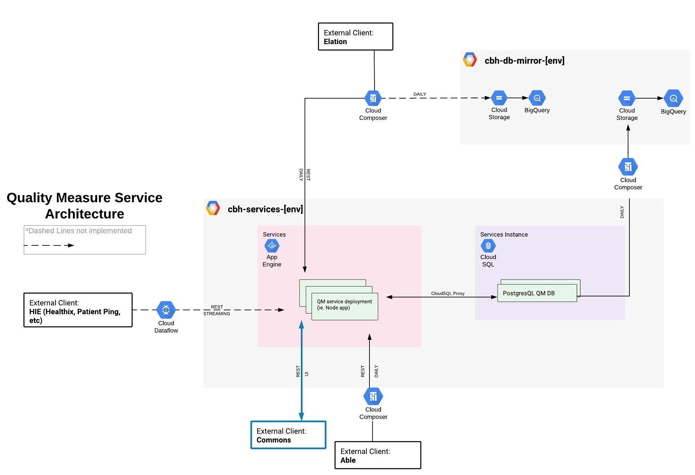

# Quality Measure (QM) Service

Quality measures are evidence-based preventative, outcome, and process-based health guidelines laid out by various
organizations such as NCQA and CMS. In all of our markets, we are accountable for the performance of payer-specified
Quality measures for our attributed population.

This service facilitates quality tracking and management in Mixer and Commons to allow our care teams to coordinate
efforts around Quality opportunity closure.

Specifically this service synthesizes members' measures' statuses set by various sources: Able Health, Commons, and Elation,  
in an event-log style table, `quality_measure.member_measure`, to return the most up-to-date status for a given member's measure on the fly.

**_Note: we will try our best to update this README to match reality, however, be aware that information may be out of date given all the dependencies of the service._**

## Table of Contents

* [Application](#application)
    * [GCP Resources - Prod](#gcp-resources---prod)
    * [GCP Resources - Staging](#gcp-resources---staging)
* [QM Service API Endpoints](#qm-service-api-endpoints)
* [Setup - QM Service](#setup---qm-service)
    * [Local Machine Installations](#local-machine-installations)
    * [Copy **quality_measure** staging database to local machine](#copy-quality_measure-staging-database-to-local-machine)
    * [Add Migrations](#add-migrations)
    * [Pull QM Service Secrets from Secret Manager](#pull-qm-service-secrets-from-secret-manager)
    * [Connect directly to Cloud SQL **quality_measure** [env] database via Postico](#connect-directly-to-cloud-sql-quality_measure-env-database-via-postico)
* [Refresh QM Service Staging DB](#refresh-qm-service-staging-db)
    * [Delete all rows in **staging** event table `quality_measure.member_measure`](#delete-all-rows-in-staging-event-table-quality_measuremember_measure)
    * [Mock Able data and post to QM Service Staging](#mock-able-data-and-post-to-qm-service-staging)
* [Setup - Commons](#setup---commons)
* [Setup - Airflow](#setup---airflow)
* [Running Locally](#running-locally)
    * [Quality Measure Service](#quality-measure-service)
    * [Commons to QM Service](#commons-to-qm-service)
    * [Able to QM Service](#able-to-qm-service)
    * [Elation to QM Service](#elation-to-qm-service)
* [Clients](#clients)
    * [Able Health](#able-health)
        * [Code - Able](#code---able)
        * [Monitoring - Able](#monitoring---able)
    * [Commons](#commons)
        * [Code - Commons](#code---commons)
        * [Monitoring - Commons](#monitoring---commons)
    * [Elation](#elation)
        * [Code - Elation](#code---elation)
        * [Monitoring - Elation](#monitoring---elation)
* [Architecture Diagram](#architecture-diagram)

## Application

_All resources managed in [terraform](../../terraform). See [qm_cloudbuild.yaml](qm_cloudbuild.yaml) for build / deploy steps._
### GCP Resources - Prod

- [Cloud Build - `quality-measure-service-prod-trigger`](https://console.cloud.google.com/cloud-build/triggers/edit/2b2a2683-e304-4fa9-b2dd-9e77bedeceb9?project=cityblock-data&organizationId=250790368607)
- [App Engine - `quality-measure`](https://console.cloud.google.com/appengine?folder=&project=cbh-services-prod&duration=PT1H&serviceId=quality-measure)
- [App Engine Error Reporting - `quality-measure`](https://console.cloud.google.com/errors?service=quality-measure&time=P30D&order=LAST_SEEN_DESC&resolution=OPEN&resolution=ACKNOWLEDGED&project=cbh-services-prod&organizationId=250790368607)
- [CloudSQL Instance - `services`, PostgresQL DB - `quality_measure`](https://console.cloud.google.com/sql/instances/services/databases?organizationId=250790368607&project=cbh-services-prod)
- [BigQuery DB Mirror - `cbh-db-mirror-prod:quality_measure_mirror`](https://console.cloud.google.com/bigquery?organizationId=250790368607&project=cbh-db-mirror-prod&p=cbh-db-mirror-prod&d=quality_measure_mirror&page=dataset)
- [Secret Manager Secrets - `prod-qm-service-[secret]`](https://console.cloud.google.com/security/secret-manager?project=cbh-secrets)
- [GCS Service Bucket - `cbh-quality-measure-service-prod`](https://console.cloud.google.com/storage/browser/cbh-quality-measure-service-prod?forceOnBucketsSortingFiltering=false&organizationId=250790368607&project=cbh-services-prod)

### GCP Resources - Staging

- [Cloud Build - `quality-measure-service-staging-trigger`](https://console.cloud.google.com/cloud-build/triggers/edit/e8cdfadb-5dca-4520-9616-3219f3f556d5?project=cityblock-data&organizationId=250790368607)
- [App Engine - `quality-measure`](https://console.cloud.google.com/appengine?project=cbh-services-staging&serviceId=quality-measure&organizationId=250790368607&duration=PT1H)
- [App Engine Error Reporting - `quality-measure`](https://console.cloud.google.com/errors?service&time=P30D&order=LAST_SEEN_DESC&resolution=OPEN&resolution=ACKNOWLEDGED&project=cbh-services-staging&organizationId=250790368607)
- [CloudSQL Instance - `services`, PostgresQL DB - `quality_measure`](https://console.cloud.google.com/sql/instances/services/databases?organizationId=250790368607&project=cbh-services-staging)
- [BigQuery DB Mirror - `cbh-db-mirror-staging:quality_measure_mirror`](https://console.cloud.google.com/bigquery?project=cbh-db-mirror-staging&p=cbh-db-mirror-staging&d=quality_measure_mirror&page=dataset)
- [Secret Manager Secrets - `staging-qm-service-[secret]`](https://console.cloud.google.com/security/secret-manager?project=cbh-secrets)
- [GCS Service Bucket - `cbh-quality-measure-service-staging`](https://console.cloud.google.com/storage/browser?project=cbh-services-staging&organizationId=250790368607&prefix=)

## QM Service API Endpoints

| **Method** |                         **Endpoint**                         |                       **Description**                        |                    **Clients**                     |
| :--------: | :----------------------------------------------------------: | :----------------------------------------------------------: | :------------------------------------------------: |
|    GET     |          `/{API_VERSION}/member/:memberId/measures`          |                   Gets a member's measures                   |                     _Commons_                      |
|    GET     |                  `/{API_VERSION}/measures`                   |                      Gets all measures                       |                 _Able to CBH DAG_                  |
|    GET     |                 `/{API_VERSION}/elationmap`                  |         Gets all measures that map to Elation codes          |                _Elation Mirror DAG_                |
|    POST    |          `/{API_VERSION}/member/:memberId/measures`          |                   Posts a member's measure                   | _Commons_, _Able to CBH DAG_, _Elation Mirror DAG_ |
|    POST    | `/{API_VERSION}/members?&measureIds&measureStatusNames` | Filters post request body of memberIds based on query params |                     _Commons_                      |

## Setup - QM Service

### Local Machine Installations

- Install [nvm](https://github.com/nvm-sh/nvm#install--update-script)
- Install the node version from the service's [package.json](./package.json), this will also install the default npm for the node:  
  `nvm install [version.number]`

- Install [Postgres app](https://postgresapp.com/) and [Postgres CLI](https://postgresapp.com/documentation/cli-tools.html).
- Install [Postico](https://eggerapps.at/postico/) for a clean UI to look at Postgres data.

### Copy **quality_measure** staging database to local machine

- Create root user (only required to be run once):  
  ```
  psql -c 'create user root with superuser;' -U postgres
  ```

- Run bash script to dump "staging" (or "prod") database to local machine:  
  ```
  bash \
  mixer/services/quality_measure/scripts/dump_qm_db_to_local \
  staging
  ```

 - To view db Postico, click `New Favorite` and populate the below fields in the pop-up:
 
    - Nickname: `local_quality_measure_[env]`
    - Host: `localhost`
    - Port: `5432`
    - User: `root`
    - Password: Leave blank.
    - Database: `quality_measure`

### Add Migrations

- To add a new database migration, run:
  ```
  npm run migrate:make migration_name
  ```
- Once the timestamped .ts file is auto-generated in [services/quality_measure/src/models/migrations](./src/models/migrations), populate the `up` and `down` functions.
- To execute the migration and confirm the `up` and `down` functions work as intended without errors, run:
  ```
  npm run migrate
  npm run migrate:rollback
  ```

### Pull QM Service Secrets from Secret Manager

- See instructions in sections `List Secrets` and `Pull Secrets` of the [Secret Management README](../../terraform/README.md#list-secrets)
   to pull QM related secrets with name space `[env]-qm-service-[some_secret]`.
   

### Connect directly to Cloud SQL **quality_measure** [env] database via Postico

_Substitute [env] with `prod` or `staging` to connect to the appropriate evnvironment database._

1. Install `cloud_sql_proxy` as described [here](https://cloud.google.com/sql/docs/postgres/connect-external-app).

1. Run the proxy to create a connection. _Pick a non-standard tcp port besides 5432, i.e. `5433`_:  
   `cloud_sql_proxy -instances=cbh-services-[env]:us-east1:services=tcp:[port]`.

1. In Postico, click `New Favorite` and populate the below fields in the pop-up:

- Nickname: `proxy_quality_measure_[env]`
- Host: `localhost`
- Port: `[port]`
- Database: `quality_measure`
- User: `[env]-qm-service-db-service-user-name` (from Secret Manager)
- Password: `[env]-qm-service-db-service-user-password` (from Secret Manager)

## Refresh QM Service Staging DB

### Delete all rows in **staging** event table `quality_measure.member_measure`

- Connect to qm staging database from terminal. Copy / paste user credentials from Secret Manager `staging-qm-service-db-service-user-[name/password]`:  
  ```
  gcloud beta sql connect services --user=[user-name] --database=quality_measure --project=cbh-services-staging
  ```
- Once connected to qm_staging db, run sql command to delete all rows in `member_measure` table:  
  ```
  DELETE FROM member_measure WHERE id IS NOT NULL;
  ```
- Close connection by pressing `ctrl-c`.

### Mock Able data and post to QM Service Staging
- Run bash script to generate fake able data and post to QM Staging Service:
- Pass in a fake date in the **current year** for `fake-able-result-date`  
  ```
  bash \
  mixer/services/quality_measure/scripts/fake_able_seed_qm_service_staging \
  [yyyy-mm-dd]
  ```
- The above script calls the [fake_able_seed_qm_service_staging.py script](../../containers/ablehealth/fake_able_seed_qm_service_staging.py) in `mixer/containers/ablehealth/`

## Setup - Commons

- See [Commons README in Github](https://github.com/cityblock/commons#onboarding).

## Setup - Airflow

- See [Airflow README in `/cloud_composer`](../../cloud_composer/README.md)
- See [DBT README in /dbt](../../dbt/README.md#local-setup-and-installation) for instructions in setting up python for local development.  
  Note you can stop following the guide once you've created your python environment.

## Running Locally

### Quality Measure Service

- runs on `http://localhost:8080`.

```
cd mixer/services/quality_measure
npm run dev
```

**Make sure QM Service is running locally before running below clients locally.**
### Commons to QM Service

- runs on `http://localhost:3000`:

```
cd commons
npm run dev
```

### [Able to QM Service](../../containers/ablehealth/gcs_to_qm_service.py)
- Pass in a fake date in the **current year** for `fake-able-result-date`
```
python \
mixer/containers/ablehealth/fake_able_seed_qm_service_staging.py \
--fake-able-result-date=[yyyy-mm-dd] \
--qm-svc-env=dev \
--qm-svc-api-key=able \
--project=cityblock-orchestration
```

### [Elation to QM Service](../../containers/elation-utils/elation_to_qm_service.py)
- Given we don't have staging Elation data, you should **not** run this locally in dev environment as you will pollute your dev database with prod member IDs.
- The below command is only shown so you see the flags required to manually run in prod environment.

- See `Clients - Elation` section below on automated prod runs in Airflow.

   ```
   cd mixer/containers/elation-utils
   python elation_to_qm_service.py --qm-svc-env=dev \
  --project=cityblock-orchestration \
  --qm-svc-api-key=elation
  ```

## Clients

### Able Health

Able is the primary source of truth for setting **open**, **excluded**, and **closed** statuses on members' measures.

#### Code - Able

- [cloud_composer/dags/cbh_to_able_v[x].py](../../cloud_composer/dags/cbh_to_able_v1.py) --> [Airflow DAG - Daily](https://r924531339b5480d9-tp.appspot.com/admin/airflow/tree?dag_id=cbh_to_able_v1)

  - **Does not hit QM directly. But has downstream effects**
  - Runs BQ queries across various datasets containing member medical info and delivers [resulting csv data](https://console.cloud.google.com/storage/browser/us-east4-prod-airflow-d4e023bb-bucket/able_health_drop/?forceOnBucketsSortingFiltering=false&project=cityblock-orchestration)  
    to Able Health on a nightly schedule.
  - Able uses this data to calculate applicable quality measures and their status for our members.

- [cloud_composer/dags/able_to_cbh_v[x].py](../../cloud_composer/dags/able_to_cbh_v1.py) --> [Airflow DAG - Daily](https://r924531339b5480d9-tp.appspot.com/admin/airflow/tree?dag_id=able_to_cbh_v1)

  - Ingests Able Health [results as csv's](https://console.cloud.google.com/storage/browser/us-east4-prod-airflow-d4e023bb-bucket/ablehealth_results/?forceOnBucketsSortingFiltering=false&project=cityblock-orchestration)
    and populates results into BQ [in raw form](https://console.cloud.google.com/bigquery?project=cityblock-data&p=cityblock-data&d=ablehealth_results&page=dataset) and [abstracted form](https://console.cloud.google.com/bigquery?project=cityblock-analytics&p=cityblock-analytics&d=abs_able&page=dataset).
  - Contains DAG task `gcs_to_qm_svc` that runs image to parse able results and post to QM Service.

- [containers/ablehealth/gcs_to_qm_service.py](../../containers/ablehealth/gcs_to_qm_service.py) --> [Airflow Task - Daily](https://r924531339b5480d9-tp.appspot.com/admin/airflow/log?task_id=gcs_to_qm_svc&dag_id=able_to_cbh_v1&execution_date=2020-03-31T17%3A02%3A14.949915%2B00%3A00&format=json)

  - Reads [Able results data from GCS](https://console.cloud.google.com/storage/browser/us-east4-prod-airflow-d4e023bb-bucket/ablehealth_results/?forceOnBucketsSortingFiltering=false&project=cityblock-orchestration), transforms the data to match QM Service API requirements.
  - Gets, via `/{API_VERSION}/measurescoderateids`, measures tracked in QM Service db to filter Able results.
  - Posts, via `/{API_VERSION}/member/:memberId/measures`, to set statuses on member's measures.
  - Writes, the [posted transformed / filtered data as csv to GCS](https://console.cloud.google.com/storage/browser/us-east4-prod-airflow-d4e023bb-bucket/ablehealth_results_to_qm_service/?project=cityblock-orchestration).
    - **This file is read by the next run of this task to generate a diff on Able's results so as to only post the diff.**
    - Generating and posting only the diff is done to control size of event-log style `quality_measure.member_measure` table and improve DAG performance, i.e. by not re-posting unchanged data.

#### Monitoring - Able

- See [Airflow DAGs README in `/cloud_composer/dags/`](../../cloud_composer/dags/README.md#monitoring-dags).

### Commons

Commons displays the most up-to-date statuses for member's measures in a table view that enables filtering by measures  
and statuses. Member's measures are also displayed on the member's page.

Additionally, care team users of Commons are able to set **open**, or **provisionally closed** statuses on member's measures.

#### Code - Commons

- [commons/server/graphql/shared/quality-measure-service.ts](https://github.com/cityblock/commons/blob/master/server/graphql/shared/quality-measure-service.ts)
  - Gets, via `/{API_VERSION}/member/:memberId/measures`, the most up-to-date member's measures.
  - Posts, via `/{API_VERSION}/member/:memberId/measures`, to set statuses on member's measures.
  - "Posts", via `/{API_VERSION}/members?&measureIds&measureStatusNames`, a request body of `memberId`s  
    along with query parameters that are used to respond with a filtered list of `memberIds` on the query parameters.
    - Filtering / querying was implemented as is, as opposed to pagination, due to infra constraints and limited member/user data stored in QM Service db.
    - Post endpoint because [axios get requests can't include a body](https://github.com/axios/axios/issues/787#issuecomment-289033577) and  
      attempting to stuff a high number of memberIds in GET query params makes URL too long and results in errors.
    - `measureIds` param: Filters for members with given measures tracked.
    - `measureStatusNames` param: Filters for members with measures that have given statuses.

#### Monitoring - Commons

- [Datadog Dashboard](https://app.datadoghq.com/dashboard/hqm-jz7-cb6/aptible-production-app-and-db?to_ts=1542029027668&is_auto=false&from_ts=1542025427668&live=true&tile_size=m&page=0)
- [GCP - Error Reporting](https://console.cloud.google.com/errors?time=P30D&order=LAST_SEEN_DESC&resolution=OPEN&resolution=ACKNOWLEDGED&project=commons-production&authuser=0&folder&organizationId)

### Elation

Every two weeks, [Able Results of members' quality measures are parsed in BQ](https://console.cloud.google.com/bigquery?project=cityblock-data&folder&organizationId=250790368607&sq=361313624421:62b4699c9e2e48d493259898ac4cee56)
and manually sent to Elation.

Elation uses the data to generate tags and codes that map to the quality measures. These tags and codes can be used in  
the Elation UI by our clinicians to tag services they provide that **close** or **exclude** previously open quality measures.

Elation has not exposed API endpoints to pull these tags, so we [mirrored our Elation hosted MySQL database](https://console.cloud.google.com/bigquery?project=cityblock-data&organizationId=250790368607&p=cityblock-data&d=elation_mirror&page=dataset) to directly access  
the data and process the tags to determine measure statuses set in Elation.

_Note we now have read-only access to all of our Elation data, both exposed and not exposed via the Elation API._

#### Code - Elation

- [cloud_composer/dags/elation_mirror_v[x].py](../../cloud_composer/dags/elation_mirror_v1.py) --> [Airflow DAG - Daily](https://r924531339b5480d9-tp.appspot.com/admin/airflow/tree?dag_id=elation_mirror_prod_v1)

  - See [Elation Mirror section of Airflow DAGs README in `/cloud_composer/dags/`](../../cloud_composer/dags/README.md#elation-mirror-dag) for more details on the mirror.
  - Contains DAG task `elation_to_qm_svc` that runs image to parse [Elation Mirror data in BQ](https://console.cloud.google.com/bigquery?project=cityblock-data&organizationId=250790368607&p=cityblock-data&d=elation_mirror&page=dataset) and post to QM Service.

- [containers/elation-utils/elation_to_qm_service.py](../../containers/elation-utils/elation_to_qm_service.py) --> [Airflow Task - Daily](https://r924531339b5480d9-tp.appspot.com/admin/airflow/log?task_id=elation_to_qm_svc&dag_id=elation_mirror_prod_v1&execution_date=2020-03-31T10%3A00%3A00%2B00%3A00&format=json)

  - Gets, via `/{API_VERSION}/elationmap`, measures and statuses mapped to Elation tags in QM Service db.
  - Runs join queries on BQ tables in: `cityblock-data.elation_mirror`, `cbh-db-mirror-prod.commons_mirror` and `cbh-db-mirror-prod.member_index_mirror`  
    to parse Elation tagged data.
  - Translates Elation tags to respective members' measures and statuses and posts to QM Service.

#### Monitoring - Elation

- See [Airflow DAGs README in `/cloud_composer/dags/`](../../cloud_composer/dags/README.md#monitoring-dags).

## Architecture Diagram


