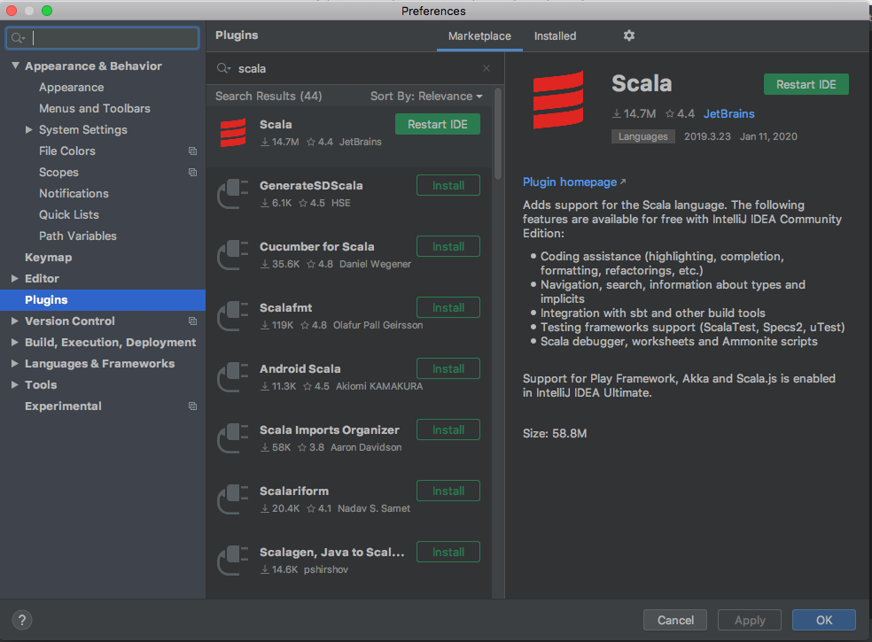

## Onboarding

1. Setting up your python environment

## Contents
- [Onboarding](#onboarding)
  - [Set up Github](#clone-mixer-repo)
  - [GCP Commandline tools](#install-google-cloud-command-line-tools)
  - [Scala environment](#install-scala-environment)
  - [Kubectl](#install-kubectl)

## Onboarding

### Clone Mixer Repo

- Install xcode by running `xcode-select --install` in the terminal. This will install git and many other tools
- Setup [two-factor auth](https://help.github.com/articles/configuring-two-factor-authentication/) with your
github account.
- [Connect to GitHub with SSH](https://help.github.com/en/articles/connecting-to-github-with-ssh). Note: you may not need to follow all the [SSH-agent steps](https://docs.github.com/en/github/authenticating-to-github/connecting-to-github-with-ssh/generating-a-new-ssh-key-and-adding-it-to-the-ssh-agent#adding-your-ssh-key-to-the-ssh-agent).
- Finally, [clone](https://help.github.com/articles/cloning-a-repository/) the cityblock/mixer repo and make sure to
select "Use SSH" to get the SSH URL.

### Install Scala Environment

These steps assume that you have installed [homebrew](https://brew.sh/) on your OSX system.

- install the Java 8 JDK - `brew install homebrew/cask-versions/adoptopenjdk8`
  - If `cask` isn't avalable through brew, you'll need to install it
    - `brew install cask`
    - then run `brew install --cask homebrew/cask-versions/adoptopenjdk8`
- install [IntelliJ Community](https://www.jetbrains.com/idea/download/download-thanks.html?platform=mac&code=IIC)
- install sbt using "SDKMAN!" 
  - [https://sdkman.io](https://sdkman.io) follow "SDKMAN!" installation instructions
  - `$ sdk install sbt`
  - [follow official instructions if all else fails](https://www.scala-sbt.org/download.html)

***NOTE***: 
Installing the most recent version is ok, since we define the sbt version we want in mixer/scio-jobs/project/build.properties
AND we define the scala version in mixer/scio-jobs/build.sbt. We are currently using `sbtVersion 1.2.7` and `scalaVersion 2.12.8`
                                                              
#### Setup - Command Line

Add to your shell profile (on Mac, file is named `.bash_profile`):
- The below 2 commands ensure that you're using java 1.8, and sets the Java thread stack size and maximum heap size
for scala compilation (run `java -X` for more info) -
```bash
echo 'export JAVA_HOME=$(/usr/libexec/java_home -v 1.8)' >>~/.bash_profile
echo 'export SBT_OPTS="-XX:+CMSClassUnloadingEnabled -XX:+UseConcMarkSweepGC -Xss36M -Xmx8G"' >>~/.bash_profile
```
- Reload your shell profile - `source ~/.bash_profile`

Compile and test `scio-jobs`:

```bash
cd mixer/scio-jobs
sbt compile
sbt test
```

***NOTE***: This may take up to 5 minutes to compile. In the meanwhile, we suggest you to read this [comic](https://xkcd.com/303/)
and spend the next few minutes talking to a co-worker or maybe even grab a coffee from the kitchen.

##### Scio-Repl

Once done, you may also wish to install the Scio-repl. This is a useful tool that may help you debug work from time to time. 
Run the following commands:

```bash
brew tap spotify/public
brew install scio
scio-repl
:quit
```

***Note:*** if you want to run the scio repl with classes from the project, do sbt repl/run within scio-jobs instead of running the one we installed with brew.

##### SBT Cheat Sheet

```bash
sbt clean
sbt compile
sbt test:compile
sbt test
sbt testOnly
sbt pack
sbt console
sbt repl/run
```

#### Setup - IntelliJ

From the launcher window ("Welcome to IntelliJ IDEA"):

- "Import Project" (select `scio-jobs` directory)

  - "Import project from external model" -> sbt
    - If sbt is not an option, install the scala plugin from the marketplace and restart IntelliJ
    
        1. Click on the "IntelliJ IDEA" in your nav bar, and select "Preferences"
        1. Choose "Plugins" in the left pane, and search for scala
        1. Click on the "Restart IDE" button when the download finishes


    
  - Set "Project JDK" to `1.8`
    - If doing this for the first time, set up a new JDK (should be location of `JAVA_HOME`)
  - Under "Use sbt shell:", check both "for imports" and "for builds"
  - "Finish"

At this point the actual IntelliJ IDE will open, and you'll see a "Build" pane with a top-level task "scio-jobs:
syncing...".

You also need to set the stack size for IntelliJ so it can compile and run scala.

- Help -> Edit Custom VM Options... (a dialogue might ask you if you want to create a .vmoptions file; go ahead and do
  this)
- add `-Xss36M` and `-Xmx8G` to the `.vmoptions` file on their own lines to set the Java thread stack size and
the maximum heap size.
- Preferences -> Build, Execution, Deployment -> Build Tools -> choose sbt -> set “Maximum heap size, MB” to `8192`

***NOTE***: Once you have Intellij set up, it is IMPORTANT to follow the style guide instructions that we use. You can
find [the style guide here](../../scio-jobs/STYLE.md).

### Install Python

This section is not a strict follow guide since many people on the team have been using python differently. This section is
merely a suggestion to setup your python environment using Anaconda/Conda. On the platform team, we are currently using python 3.xx

You can download Anaconda [here](https://www.anaconda.com/distribution/) and create environments using the command
`conda create -n <env-name> python=3.7`.

You should name your environments either on the project you're working in or a catch-all based on the version. For example, you
could name the environment `version-3.7`

Alternatively, you could use pyenv which is a much more lightweight tool than Anaconda. You can install 
[pyenv here](https://github.com/pyenv/pyenv#basic-github-checkout) and set the version by following the instructions
in the dbt [README.md guide](../../dbt/README.md).

### Install Google Cloud Command-Line-Tools

Google Cloud Command-line-tools uses python 3 underneath. By default, MacOS uses python2. Using the steps above, please ensure you
have python3 installed before continuing. You can verify your python version by typing `which python`, if this returns
`/usr/local/bin/python`, then you need to install python 3. 

1. Install the command line tools by downloading the `.tar.gz` file [here](https://cloud.google.com/sdk/docs/quickstart-macos).
1. Navigate to downloads directory
1. mv <google-cloud-sdk.tar.gz file> ~/ to move the file to home directory
1. cd to navigate to home directory
1. open <google-cloud-sdk.tar.gz file> open the file
1. ./google-cloud-sdk/install.sh to run the executables
1. Restart terminal
1. Now can run `gcloud init` (default to the zone `us-east-1c`)
1. Next run `gcloud auth application-default login` (DO NOT SKIP)
1. Finally run `gcloud components update`

### Install Kubectl

Simply run the command `gcloud components install kubectl`

### Install Terraform

Currently, we are using terraform version 0.12.8.

- Install [tfenv](https://github.coms/tfutils/tfenv) `brew install tfenv`
- Install 0.12.8 `tfenv install 0.12.8`
- Default to that version `tfenv use 0.12.8`
- Confirm `terraform --version`